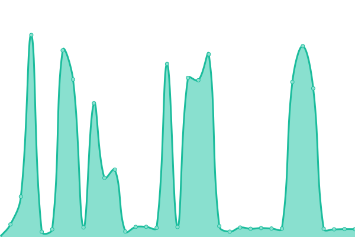

# Δ EXTRANET STATUS Δ

# [📈 Live Status](https://extratone.github.io/up): <!--live status--> **🟧 Partial outage**

<!--start: status pages-->
<!-- This summary is generated by Upptime (https://github.com/upptime/upptime) -->
<!-- Do not edit this manually, your changes will be overwritten -->
<!-- prettier-ignore -->
| URL | Status | History | Response Time | Uptime |
| --- | ------ | ------- | ------------- | ------ |
|  [Extratone](https://www.extratone.com) | 🟩 Up | [extratone.yml](https://github.com/extratone/up/commits/HEAD/history/extratone.yml) | 

 573ms
     
 | 

<a href="https://extratone.github.io/up/history/extratone">100.00%</a>
    

|  [Bilge](https://bilge.world) | 🟩 Up | [bilge.yml](https://github.com/extratone/up/commits/HEAD/history/bilge.yml) | 

 1056ms
     
 | 

<a href="https://extratone.github.io/up/history/bilge">100.00%</a>
    

|  [XYZ](https://davidblue.xyz) | 🟩 Up | [xyz.yml](https://github.com/extratone/up/commits/HEAD/history/xyz.yml) | 

 556ms
     
 | 

<a href="https://extratone.github.io/up/history/xyz">99.87%</a>
    

|  [WTF](https://davidblue.wtf) | 🟥 Down | [wtf.yml](https://github.com/extratone/up/commits/HEAD/history/wtf.yml) | 

 0ms
     
 | 

<a href="https://extratone.github.io/up/history/wtf">0.00%</a>
    

|  [Honk](https://dieselgoth.com) | 🟩 Up | [honk.yml](https://github.com/extratone/up/commits/HEAD/history/honk.yml) | 

 257ms
     
 | 

<a href="https://extratone.github.io/up/history/honk">100.00%</a>
    

|  [Shife](https://shife.writeas.com) | 🟥 Down | [shife.yml](https://github.com/extratone/up/commits/HEAD/history/shife.yml) | 

 194ms
     
 | 

<a href="https://extratone.github.io/up/history/shife">100.00%</a>
    

<!--end: status pages-->

## [WEB DISPLAY](https://extratone.github.io/up)
