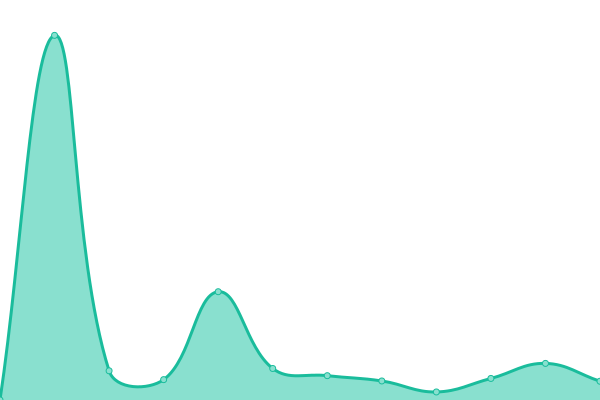

# Δ EXTRANET STATUS Δ

# [📈 Live Status](https://extratone.github.io/up): <!--live status--> **🟧 Partial outage**

<!--start: status pages-->
<!-- This summary is generated by Upptime (https://github.com/upptime/upptime) -->
<!-- Do not edit this manually, your changes will be overwritten -->
<!-- prettier-ignore -->
| URL | Status | History | Response Time | Uptime |
| --- | ------ | ------- | ------------- | ------ |
|  [Extratone](https://www.extratone.com) | 🟥 Down | [extratone.yml](https://github.com/extratone/up/commits/HEAD/history/extratone.yml) | 

 639ms
     
 | 

<a href="https://extratone.github.io/up/history/extratone">100.00%</a>
    

|  [Bilge](https://bilge.world) | 🟥 Down | [bilge.yml](https://github.com/extratone/up/commits/HEAD/history/bilge.yml) | 

 524ms
     
 | 

<a href="https://extratone.github.io/up/history/bilge">100.00%</a>
    

|  [UIKeyCommand](https://uikeycommand.com) | 🟩 Up | [ui-key-command.yml](https://github.com/extratone/up/commits/HEAD/history/ui-key-command.yml) | 

 385ms
     
 | 

<a href="https://extratone.github.io/up/history/ui-key-command">100.00%</a>
    

|  [Honk](https://dieselgoth.com) | 🟩 Up | [honk.yml](https://github.com/extratone/up/commits/HEAD/history/honk.yml) | 

 378ms
     
 | 

<a href="https://extratone.github.io/up/history/honk">100.00%</a>
    

|  [Chaff](https://chaff.writeas.com/) | 🟥 Down | [chaff.yml](https://github.com/extratone/up/commits/HEAD/history/chaff.yml) | 

 1221ms
     
 | 

<a href="https://extratone.github.io/up/history/chaff">100.00%</a>
    

|  [Iowa](https://iowa.neocities.org) | 🟩 Up | [iowa.yml](https://github.com/extratone/up/commits/HEAD/history/iowa.yml) | 

 502ms
     
 | 

<a href="https://extratone.github.io/up/history/iowa">100.00%</a>
    

|  [RoutineHub](https://routinehub.co) | 🟥 Down | [routine-hub.yml](https://github.com/extratone/up/commits/HEAD/history/routine-hub.yml) | 

 3667ms
     
 | 

<a href="https://extratone.github.io/up/history/routine-hub">65.80%</a>
    

<!--end: status pages-->

## [WEB DISPLAY](https://extratone.github.io/up)
