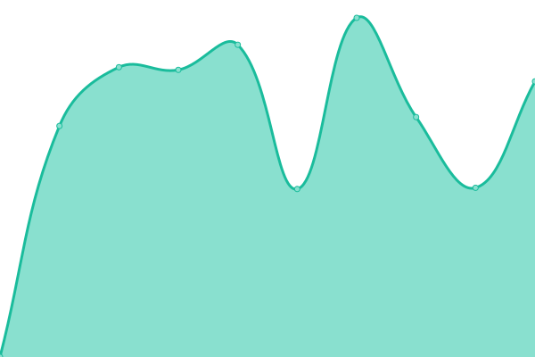

# Δ EXTRANET STATUS Δ

# [📈 Live Status](https://extratone.github.io/up): <!--live status--> **🟧 Partial outage**

<!--start: status pages-->
<!-- This summary is generated by Upptime (https://github.com/upptime/upptime) -->
<!-- Do not edit this manually, your changes will be overwritten -->
<!-- prettier-ignore -->
| URL | Status | History | Response Time | Uptime |
| --- | ------ | ------- | ------------- | ------ |
| [Extratone](https://www.extratone.com) | 🟥 Down | [extratone.yml](https://github.com/extratone/up/commits/master/history/extratone.yml) | 

 3143ms
     
 | 

   

| [Bilge](https://bilge.world) | 🟥 Down | [bilge.yml](https://github.com/extratone/up/commits/master/history/bilge.yml) | 

 2442ms
     
 | 

   

| [XYZ](https://davidblue.xyz) | 🟩 Up | [xyz.yml](https://github.com/extratone/up/commits/master/history/xyz.yml) | 

 645ms
     
 | 

   

| [WTF](https://davidblue.wtf) | 🟩 Up | [wtf.yml](https://github.com/extratone/up/commits/master/history/wtf.yml) | 

 2442ms
     
 | 

   

| [Honk](https://dieselgoth.com) | 🟩 Up | [honk.yml](https://github.com/extratone/up/commits/master/history/honk.yml) | 

 1177ms
     
 | 

   

| [Shife](https://shife.writeas.com) | 🟩 Up | [shife.yml](https://github.com/extratone/up/commits/master/history/shife.yml) | 

 1756ms
     
 | 

   

<!--end: status pages-->

## [WEB DISPLAY](https://extratone.github.io/up)
