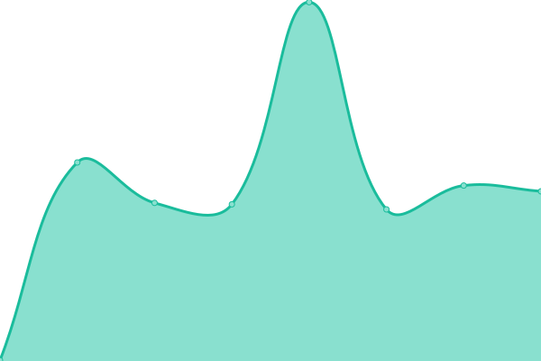

# Δ EXTRANET STATUS Δ

# [📈 Live Status](https://extratone.github.io/up): <!--live status--> **🟧 Partial outage**

<!--start: status pages-->
<!-- This summary is generated by Upptime (https://github.com/upptime/upptime) -->
<!-- Do not edit this manually, your changes will be overwritten -->
<!-- prettier-ignore -->
| URL | Status | History | Response Time | Uptime |
| --- | ------ | ------- | ------------- | ------ |
|  [Extratone](https://www.extratone.com) | 🟩 Up | [extratone.yml](https://github.com/extratone/up/commits/HEAD/history/extratone.yml) | 

 1191ms
     
 | 

<a href="https://extratone.github.io/up/history/extratone">94.76%</a>
    

|  [Bilge](https://bilge.world) | 🟥 Down | [bilge.yml](https://github.com/extratone/up/commits/HEAD/history/bilge.yml) | 

 1385ms
     
 | 

<a href="https://extratone.github.io/up/history/bilge">69.00%</a>
    

|  [XYZ](https://davidblue.xyz) | 🟥 Down | [xyz.yml](https://github.com/extratone/up/commits/HEAD/history/xyz.yml) | 

 0ms
     
 | 

<a href="https://extratone.github.io/up/history/xyz">0.00%</a>
    

|  [Social Directory (Notion)](https://www.notion.so/9fdc8e9610b34b8f991ebc148b760055?v=c170b58650c04fbdb7adc551a73d16a7) | 🟩 Up | [social-directory-notion.yml](https://github.com/extratone/up/commits/HEAD/history/social-directory-notion.yml) | 

 171ms
     
 | 

<a href="https://extratone.github.io/up/history/social-directory-notion">100.00%</a>
    

|  [Honk](https://dieselgoth.com) | 🟩 Up | [honk.yml](https://github.com/extratone/up/commits/HEAD/history/honk.yml) | 

 376ms
     
 | 

<a href="https://extratone.github.io/up/history/honk">100.00%</a>
    

|  [Handset](https://handset.writeas.com/) | 🟥 Down | [handset.yml](https://github.com/extratone/up/commits/HEAD/history/handset.yml) | 

 231ms
     
 | 

<a href="https://extratone.github.io/up/history/handset">0.00%</a>
    

|  [Handset (WP Test)](https://handsetmag.wordpress.com) | 🟩 Up | [handset-wp-test.yml](https://github.com/extratone/up/commits/HEAD/history/handset-wp-test.yml) | 

 379ms
     
 | 

<a href="https://extratone.github.io/up/history/handset-wp-test">100.00%</a>
    

<!--end: status pages-->

## [WEB DISPLAY](https://extratone.github.io/up)
